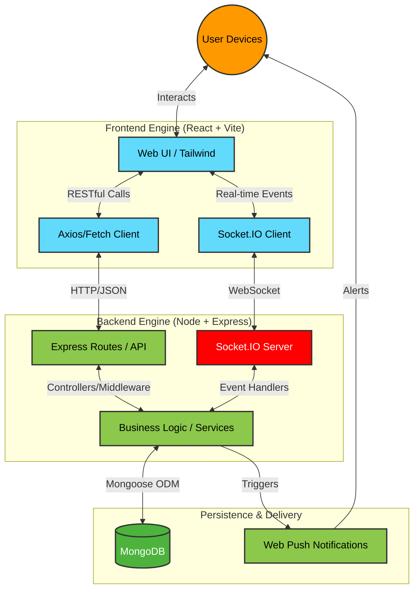

# VaaniArc

VaaniArc is a web-first real-time chat and collaboration application built with React, Vite, Node.js, Express, Socket.IO, MongoDB, and Redis-ready infrastructure. It supports account management, public and private messaging, rooms, meetings, passkeys, TOTP, encrypted recovery-kit escrow, device-aware encryption flows, and push-based realtime updates.

## Workflow Diagram



## 🚀 Core & Advanced Features

VaaniArc is packed with foundational and advanced features designed for seamless, scalable, and secure communication:

- **Real-Time Messaging:** Instant delivery for both public rooms and direct private chats via Socket.IO.
- **Channels & Communities:** Organize users into logical groups and broadcast channels.
- **Meetings & Audio/Video Collaboration:** Built-in meeting interfaces for team collaboration.
- **End-to-End Encryption (E2EE):** Secure messaging with device-aware encryption payloads and continuous key management.
- **Key Transparency:** Advanced cryptographic guarantees making sure public keys haven't been tampered with.
- **Advanced Authentication:** Password login fallback, passkey/WebAuthn support, TOTP-based 2FA, and secure cookie session management.
- **Multi-Device Handling:** Native support for managing active sessions and device-specific keys across multiple platforms simultaneously.
- **Encrypted Social Recovery:** Recovery kits use Shamir secret sharing in the client and store only encrypted shard envelopes on the server.
- **File Uploads & Sharing:** Secure file transmission, access control, and size validation mechanisms.
- **Message Reliability:** Built-in message and operation idempotency, preventing duplicate messages upon network drops, plus optimistic locking for concurrent database operations.
- **Web Push Notifications:** Native push-based realtime alerts ensuring users are notified of events even when tab is out of focus.
- **Security & Audit:** Robust API rate limiting, auth middleware, and continuous audit logging.

## ✨ What Sets VaaniArc Apart

While many chat applications offer basic messaging, VaaniArc natively integrates several advanced architectural choices often skipped by standard chat tools:

- **Integrated Key Transparency System:** Unlike standard chat apps, VaaniArc verifies E2EE keys transparently without relying strictly on trust-on-first-use (TOFU), giving users cryptographically verifiable security.
- **Native Idempotency & Optimistic Locking:** Ensures no multi-device sync collisions or duplicated deliveries during high latency or intermittent offline scenarios.
- **Decoupled Identity System:** Full identity verification and account management without reliance on external verifiers like SMS gateways or third-party mailing networks.
- **Device-Level Granular Security:** The system tracks not just 'User' encryption, but 'Device-Aware' keys, allowing exact revocation and secure rotations perfectly tailored per device.

## 🔮 Future Roadmap (What We Are Building Next)

To establish VaaniArc as a massive enterprise and production-ready system better than current market leaders, our roadmap includes advanced features that many other apps already have (like massive group calls) or will be uniquely pioneering:

- **Passwordless Login (WebAuthn/Passkeys):** Shifting to FaceID/Fingerprint logins via `@simplewebauthn`. For account recovery, we will implement "Social Recovery" (Shamir's Secret Sharing) where 5 trusted friends hold key splits—requiring 3 approvals to recover access.
- **Massive Group Calls (SFU Integration):** Standard WebRTC limits calls to 5-6 users. We are transitioning our backend to use `mediasoup` (SFU proxy) to support huge 100+ participant rooms similar to Zoom or Discord.
- **True Offline Sync (CRDTs):** Current standard messaging can suffer overlap when reconnecting to the internet. We will use React front-end CRDTs (`Yjs` or `Automerge`) for flawless, conflict-free merging of offline edits.
- **On-Device Translation (WASM):** Using cloud APIs compromises E2EE. Our plan includes local WebAssembly (WASM) models directly in the browser to translate chats in real-time securely on the user's device.
- **Offline Mesh Network:** Adding Bluetooth and Wi-Fi Direct support so messages can hop through a localized offline mesh network of nearby devices when centralized internet is unavailable!

## Tech Stack

### Frontend

- React
- Vite
- Tailwind CSS
- Socket.IO Client
- Radix UI

### Backend

- Node.js
- Express
- Socket.IO
- MongoDB with Mongoose
- JWT and session security middleware
- Web Push

## Quick Start

### Prerequisites

- Node.js 18+
- npm 8+
- MongoDB local instance or MongoDB Atlas

### Install

```bash
git clone https://github.com/ViktorRez99/Vaaniarc_chatApp.git
cd Vaaniarc_chatApp
npm run setup
```

### Environment

Create a root `.env` file:

```env
PORT=3000
NODE_ENV=development
CLIENT_URL=http://localhost:5173
MONGODB_URI=mongodb://127.0.0.1:27017/chatapp
JWT_SECRET=replace_this_with_a_strong_secret
JWT_EXPIRES_IN=7d
MAX_FILE_SIZE=5242880
```

### Run in Development

```bash
npm run dev:full
```

`dev:full` starts backend and frontend together. If port `3000` is already busy, the launcher will select the next available backend port automatically.

Default local URLs:

- Frontend: `http://localhost:5173`
- Backend: `http://localhost:3000`

### Local Parity Stack

For local MongoDB + Redis parity with the production topology:

```bash
docker compose up -d
```

Then use:

```env
MONGODB_URI=mongodb://127.0.0.1:27017/chatapp
REDIS_URL=redis://127.0.0.1:6379
FRONTEND_URL=http://localhost:5173
```

## Project Structure

```text
vaaniArc/
|- client/
|  |- src/
|  |  |- components/
|  |  |- context/
|  |  |- services/
|  |  |- utils/
|  |  |- App.jsx
|  |  `- main.jsx
|  `- package.json
|- server/
|  |- middleware/
|  |- models/
|  |- routes/
|  |- services/
|  |- utils/
|  |- entry.js
|  `- server.js
|- tests/
|- package.json
`- README.md
```

## Key Runtime Flow

1. Users authenticate from the React frontend.
2. The frontend can authenticate with password or passkey, then bootstraps device-bound encryption in the background.
3. The frontend sends REST requests for auth, profile, recovery kits, chat, room, upload, and device actions.
4. The backend validates requests, stores only encrypted recovery shards for social recovery, and persists state in MongoDB.
5. Socket.IO carries realtime chat, presence, and event updates back to connected clients.
6. Push notifications are delivered through the service worker and Web Push when supported.

## Project Team & Contributions

### Members

- **Frontend**: Rudrashis Das, Jaya Mondal, Ankur Barik, Sayan Ghosh
- **Backend**: Abhrajyoti Nath ([@abhrajyoti-01](https://github.com/abhrajyoti-01))

### Contribution Overview

This project automatically tracks who contributed and how much work they submitted based on GitHub history. Below you can see the dynamic contributors metrics shown by `contrib.rocks` and Shields.io:

[](https://github.com/ViktorRez99/Vaaniarc_chatApp/graphs/contributors)

[](https://github.com/ViktorRez99/Vaaniarc_chatApp/graphs/contributors)

*(Information auto-updates based on commits pushed to the repository).*

## Important Notes

- Support and issue tracking should go through GitHub Issues.
- If contributor identities change or more commits are pushed under different names, update the contribution table accordingly.

## Build

```bash
npm run build
```

## Test

```bash
npm test
```

## Support

Open an issue in this repository for bugs, fixes, or feature requests.
