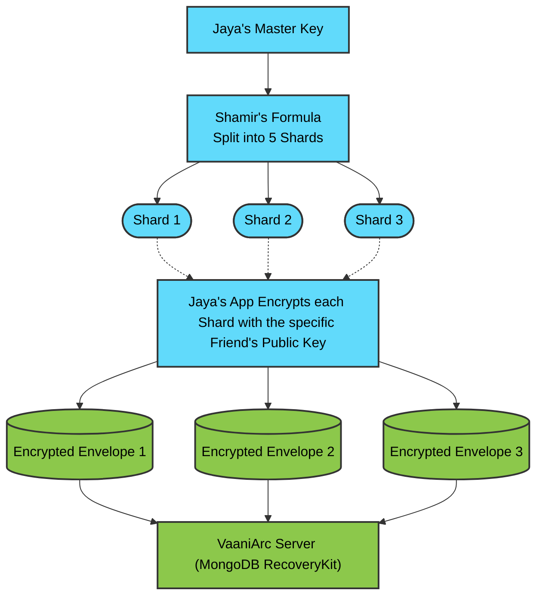
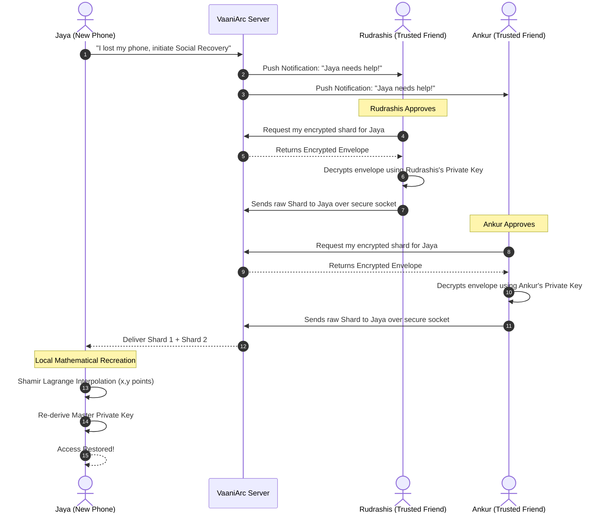

# Social Account Recovery (Shamir's Secret Sharing)

In zero-trust, end-to-end encrypted environments, losing a device could mean losing your private keys permanently. VaaniArc solves this without weakening security by utilizing **Shamir's Secret Sharing Scheme (SSS)** for Social Recovery.

## 🏗️ System Architecture

VaaniArc implements the `RecoveryKit` system which splits Master Private Keys into mathematical shards. These shards are sent to trusted contacts (friends/family). Since mathematically `K` shards are needed, `K-1` shards yield absolutely zero information about the Master Key.

### Key Components

| Component | File / Location | Description |
| :--- | :--- | :--- |
| **RecoveryKit Model** | `server/models/RecoveryKit.js` | Defines the central escrow structure in MongoDB. It stores the exact setup logic, tracking exactly who are the trusted contacts required for recovery. |
| **Trusted Contacts** | `trustedContactSchema` | Contains the `userId`, `usernameSnapshot`, and `shareIndex` (the "X" value of the polynomial point). |
| **Shard Envelopes** | `shardEnvelopeSchema` | The VaaniArc backend acts strictly as an escrow. The `encryptedEnvelope` holds the shard, which has been encrypted with the specific trusted contact's public key beforehand. The server cannot access the shard. |
| **Auth Routes** | `server/routes/authRecovery.js` | Handles the endpoints to assemble and request authorization from trusted contacts for shard release. |

---

## 🧩 Shard Splitting & Distribution Flow

## 🔄 The Recovery Procedure

When Jaya gets a new phone and needs her keys, she initiates a recovery mechanism.

1. **Initiation:** Jaya requests Account Recovery via the UI.
2. **Notification:** The `authRecovery.js` route pushes notifications to Jaya's active Trusted Contacts (Friends).
3. **Approval:** A Trusted Contact opens their VaaniArc app, which fetches an `encryptedEnvelope` from the `RecoveryKit`.
4. **Decryption:** The friend's device uses their *personal private key* to decrypt the envelope, exposing Jaya's Shard.
5. **Transport:** The friend securely passes this Shard back to Jaya (over a secure E2EE channel).
6. **Interpolation:** Once Jaya has `K` (the threshold number of) Shards, her client runs Lagrange Interpolation. The original Master Key is re-synthesized instantly.

