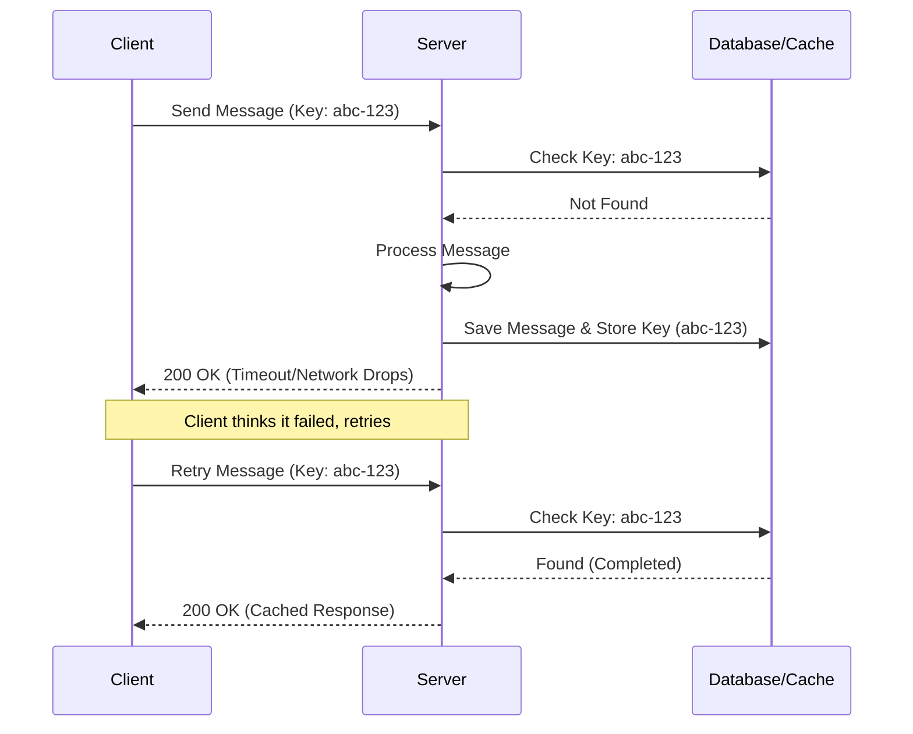

# Core Algorithms & Data Reliability

VaaniArc implements enterprise-grade reliability patterns typically found in financial systems to ensure message delivery and prevent data corruption in high-concurrency environments.

## 1. Message & Operation Idempotency
When dealing with unstable network connections (e.g., mobile devices passing through tunnels), clients might send the same message or perform the same operation multiple times because they didn't receive the server's acknowledgment.

### How VaaniArc handles it:
- **Idempotency Keys:** Every critical client operation (sending a message, joining a channel) is accompanied by a unique `idempotencyKey` (UUIDv4) generated by the client.
- **Cache Checking (`operationIdempotency.js` & `messageIdempotency.js`):** 
  - Before processing, the backend checks Redis/Memory for the presence of this key.
  - If the key exists and the operation is marked "processing", the request is delayed or rejected.
  - If the key exists and is marked "completed", the server immediately returns the cached successful response *without* re-running the database insertion.
- **Result:** No duplicate messages, no double-charges, and safe retry mechanisms.

## 2. Optimistic Locking
In collaborative environments (e.g., updating a group description, mutating user roles), two admins might try to modify the same resource at the exact same millisecond. 

### How VaaniArc handles it (`optimisticLock.js`):
- We utilize Mongoose's built-in `__v` (version key) parameter on documents.
- When an admin fetches the Community document, they receive it at Version 1.
- If Admin A updates the document, it increments to Version 2.
- If Admin B tries to update their stale Version 1 document, the backend query `findOneAndUpdate({ _id: id, __v: 1 }, updates)` will simply fail to find a matching document.
- The server throws a `409 Conflict` (Version Conflict) and prompts Admin B to refresh the latest state before applying their changes.

## 3. Shamir's Secret Sharing (Account Escrow)
*Refer to `account-recovery.md` for the complete Shamir's formulation and recovery process, and `end-to-end-encryption.md` for post-quantum details.*
VaaniArc allows users to recover their encryption keys without a password by utilizing Shamir's algorithm. To ensure zero-knowledge proofs on the backend:
- The device splits the Master Key locally in memory using mathematical polynomial formulas.
- The shards are encrypted with trusted friends' public keys *before* ever leaving the device.
- The server stores the heavily encrypted, opaque shards (`shardEnvelopeSchema`) and only releases them when a recovery challenge is successfully authorized by the trusted friends.
- Once the user retrieves enough shards to reach the threshold `K`, their local client applies Lagrange Interpolation to perfectly reconstruct the original keys without the central server ever seeing them.