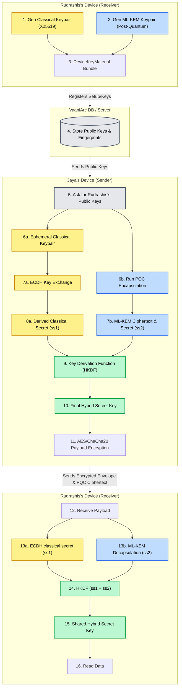
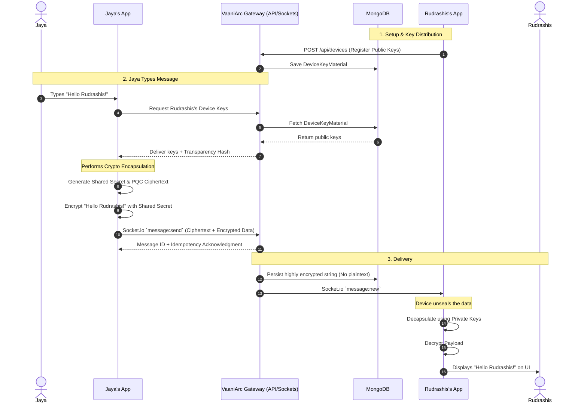

# Post-Quantum End-to-End Encryption (PQ-E2EE)

VaaniArc implements a hybrid Key Encapsulation Mechanism (KEM) to protect data both now against classical computing and in the future against quantum-based attacks. 

## 🏗️ System Architecture

Our backend relies on robust Device-Aware models instead of User-Aware models. Each platform a user logs into holds completely unique `DeviceKeyMaterial`. 

### Key Components

| Component | File / Location | Description |
| :--- | :--- | :--- |
| **DeviceKeyMaterial** | `server/models/DeviceKeyMaterial.js` | Stores public keys (`encryptionPublicKey`, `signingPublicKey`) specifically bound to a `deviceId`. Includes cold path material and key hashes. |
| **KeyTransparency** | `server/utils/keyTransparency.js` | Uses stable JSON serialization and SHA-256 to hash the `keyBundle` structures. This prevents servers from maliciously injecting rogue keys without triggering an integrity alarm on clients. |
| **E2EE Payloads** | `server/utils/e2eePayloads.js` | Formats and validates that the raw ciphertext bytes being transmitted over the wire adhere strictly to the cryptographic framing requirements. |

---

## 🔒 The Hybrid KEM Flow (Classical + Post-Quantum)

To guarantee security against "Harvest Now, Decrypt Later" quantum attacks, VaaniArc blends standard Elliptic Curve Cryptography (X25519) with Post-Quantum Lattice algorithms (like ML-KEM).

## 🔐 The "Send to Receive" User Journey

This visualizes exactly how user messages flow through the components when Jaya hits SEND.

