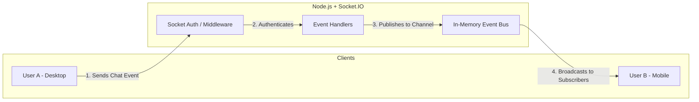

# Real-Time WebSocket Architecture

VaaniArc uses an advanced event-driven architecture powered by Socket.IO to enable seamless, low-latency communication. Over 80% of immediate data delivery is executed over the WebSocket layer rather than standard REST endpoints.

## Real-Time Delivery Flow

### 1. Connection & Authentication (`socketAuth.js`)
Since WebSockets remain open for a long period, authenticating the connection securely is critical.
1. The client establishes a connection using encrypted HTTP headers (Cookies or Bearer).
2. The `socketAuth` middleware intercepts the handshake. It validates the JWT session.
3. If authentic, the `socket.user` object is populated with identity data.
4. The client is immediately subscribed to their specific "Personal Room" (e.g., `user:<userId>`).

### 2. Presence & Status Management
VaaniArc tracks if a user is online, idle, or offline.
- When a user connects to the socket, they are flagged as `online`.
- The system broadcasts the online status to all users who share a mutual private chat or are in the same community server.
- The `socketAdapter.js` gracefully handles unexpected disconnects (like closing the lid of a laptop) and updates the status across the grid.

### 3. Emitting & Subscribing (`socketPayloads.js`)

VaaniArc defines strict definitions across standard payloads to manage UI updates without needing to refresh pages.

### Supported Socket Events

| Event Name | Direction | Payload Description | Purpose |
| ---------- | --------- | ------------------- | ------- |
| `message:new` | Server -> Client | Fully encrypted message body, sender ID, timestamp, channel ID | Notifies client of an incoming message to instantly append to the chat UI. |
| `message:typing` | Bidirectional | Boolean (isTyping), channel ID | Indicates when someone is currently typing in a specific context. |
| `user:status` | Server -> Client | User ID, Status (online/offline) | Updates avatars with green online dots across the UI. |
| `call:incoming` | Bidirectional | WebRTC SDP offer, connection identifiers | Handles P2P setup routing for Meeting functionality. |

### 4. Event Processing and Scaling
A standard Socket.IO server is bound to the memory of a single Node.js process. VaaniArc connects all sockets utilizing native `Node.js` multi-processing (using Node's `cluster` module).
- Using pure In-Memory caching inside the master process, events broadcast effortlessly to connected local sockets.
- The `entry.js` file handles forking worker processes so that the heavy lifting doesn't block the real-time event loop on the main process.